# 🛡️ Security Investigation Report
## Internet-Exposed Virtual Client Analysis

<div align="center">


</div>

---

## 📋 Executive Summary

**Target System:** `mps-mde-w11`  
**Exposure Duration:** 3 days (as of Nov 25, 2025)  
**Analysis Platform:** Microsoft Defender for Endpoint  
**Outcome:** ✅ No successful unauthorized access detected

---

## 🔍 Timeline & Findings

### 1️⃣ Data Collection

**Virtual client exposure period:**
- **System:** `mps-mde-w11`
- **Exposure Duration:** 3 days
- **Last Internet-Facing Timestamp:** `2025-11-26T15:37:23.2046413Z`

<details>
<summary>📊 <b>KQL Query</b></summary>
```kql
[Query to be added]
```

</details>

---

### 2️⃣ Threat Actor Detection

Multiple bad actors were discovered attempting to breach the target machine.

<details>
<summary>📊 <b>KQL Query</b></summary>
```kql
[Query to be added]
```

**Query Results:**
```
_________
```

</details>

---

### 3️⃣ Failed Login Attempts Analysis

The IP address with the most failed login attempts was **unable to successfully access** the target machine.

<details>
<summary>📊 <b>KQL Query</b></summary>
```kql
[Query to be added]
```

**Query Results:**
```
_________
```

</details>

---

### 4️⃣ Successful Login Summary

**Key Finding:** Only the legitimate `mpsadmin` account successfully logged in (6 times in the last 30 days).

<details>
<summary>📊 <b>KQL Query</b></summary>
```kql
[Query to be added]
```

**Query Results:**
```
_________
```

</details>

---

### 5️⃣ mpsadmin Account Security Verification

**Zero (0) failed logons** by the `mpsadmin` user account were recorded.

> **Analysis:** This indicates:
> - ❌ No brute force attack attempts against this account
> - ❌ One-time password guess is highly unlikely
> - ✅ All logins were legitimate

<details>
<summary>📊 <b>KQL Query</b></summary>
```kql
[Query to be added]
```

**Query Results:**
```
_________
```

</details>

---

### 6️⃣ Geographic Source Analysis

Review of IP addresses used to login to `mpsadmin` account shows **only one IP address** associated with the account.

**Location:** 🇺🇸 United States

<details>
<summary>📊 <b>KQL Query</b></summary>
```kql
[Query to be added]
```

**Query Results:**
```
_________
```

</details>

---

## 📊 Data Analysis

<table>
<tr>
<td width="50%">

### ✅ Confirmed
- Device exposed to internet
- Multiple brute force attempts detected
- All legitimate logins from authorized sources
- No unauthorized access occurred

</td>
<td width="50%">

### 🎯 Conclusion
Despite internet exposure and clear attack attempts, there is **no evidence** of:
- Brute force success
- Unauthorized access
- Compromise of `mpsadmin` account

</td>
</tr>
</table>

---

## 🎯 Investigation: MITRE ATT&CK Mapping

| TTP ID | Technique | Relevance |
|--------|-----------|-----------|
| **T1190** | Exploit Public-Facing Application | ⚠️ Machine was internet-facing |
| **T1078** | Valid Accounts | ✅ Successful logons by legitimate `mpsadmin` |
| **T1110** | Brute Force | 🔴 Failed logon attempts from multiple IPs |
| **T1587** | Develop Capabilities: Exploit Code | ⚠️ Indirect inference from attacker behavior |

## 🔧 Response & Remediation

### Immediate Actions Taken

```mermaid
graph LR
    A[🔍 Detection] --> B[🚨 MDE Quarantine]
    B --> C[🔒 NSG Hardening]
    C --> D[🔐 MFA Implementation]
    D --> E[✅ Secured]
    
    style A fill:#ff6b6b
    style E fill:#51cf66
```


#### 1. Microsoft Defender for Endpoint Detection Rules
- ✅ Configured automated detection rules for suspicious login patterns
- ✅ Enabled VM quarantine for threat containment
- ✅ Isolated machine from network during investigation

#### 2. Network Security Group (NSG) Hardening
- ✅ Restricted RDP traffic to specific authorized endpoints only
- ✅ Removed public internet access
- ✅ Implemented IP allowlisting

#### 3. Multi-Factor Authentication (MFA)
- ✅ Enabled MFA for `mpsadmin` account
- ✅ Enhanced authentication requirements

---

## 🏆 Lessons Learned

> **Key Takeaway:** Proper security controls (strong passwords, limited exposure) successfully prevented unauthorized access despite sustained attack attempts.

### Security Posture Improvements
1. ✅ Validated effectiveness of existing security controls
2. ✅ Enhanced network segmentation
3. ✅ Implemented additional authentication layers
4. ✅ Established monitoring and alerting baseline

---

<div align="center">

**Investigation Completed:** November 26, 2025  
**Status:** 🟢 Closed - No Breach Detected

---

*This investigation demonstrates the importance of defense-in-depth security strategies.*

</div>
